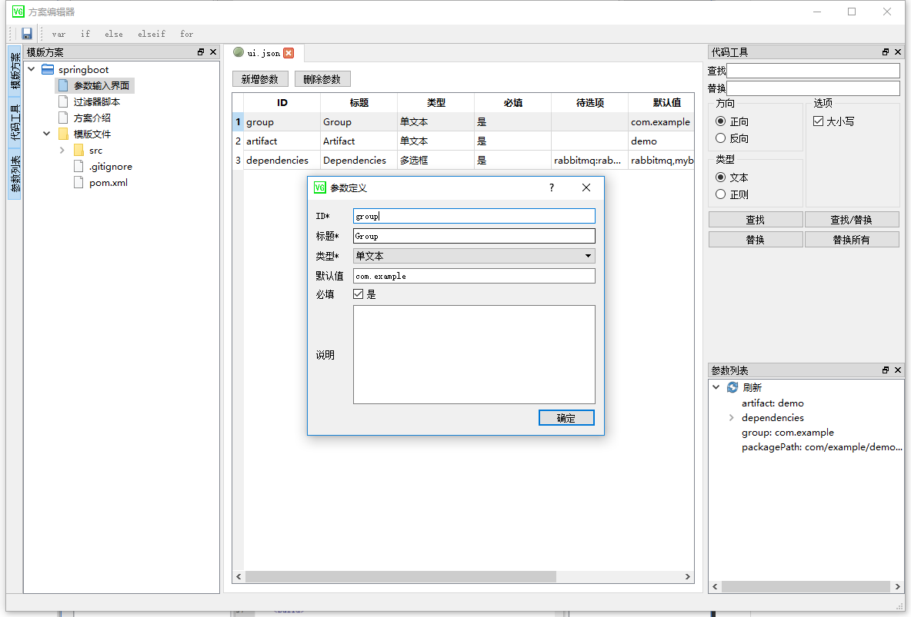

## 简介
Visual Generator是一个可视化的模版编辑器，
通常可以作为项目的脚手架工具。  
通过自定义的 【参数输入界面】 -> 【过滤器脚本自由变换】 -> 【模版生成】  
方便高效的生成项目文件。

[模版语法](https://mozilla.github.io/nunjucks/cn/templating.html "nunjucks") 为jinja语法    

特殊处只有，使用了自定义的标记符号   
变量使用 [[[  ]]]   
语句使用 [[%  %]]  

### 操作步骤
1. "方案"菜单新增方案  
  

2. 进入"方案编辑器"。编辑"参数输入界面" 定义参数，目前只支持 文本框 文本域 单选框 多选框  
  

3. 编译"过滤器脚本"，实际为javascript脚本。 将步骤2的 参数，自由变化，增减改参数。  
  

4. 编辑，使用模版语法进行编辑
左侧"模版文件" 支持从系统中直接拖拽拷贝进来，
上部的工具栏有常用语句插入按钮。  
右上“代码工具”提供查找替换功能，
右下提供参数列表，来源为 步骤2的参数，经过步骤3过滤后的结果。  
  

5. 关闭"方案编辑器",退回主工具界面，填写需要的参数值后，点击“生成”按钮，则会生成文件。  

